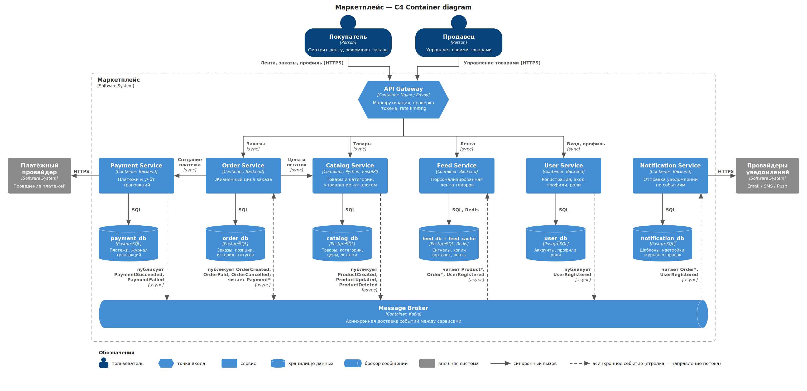

# Архитектура маркетплейса

Репозиторий содержит рписание архитектуры маркетплейса и один запускаемый сервис `Catalog Service` без бизнес-логики.

Было зафиксированно следующее решение: шесть сервисов, по одному на домен, у каждого своя база данных. Клиентские запросы идут синхронно через API Gateway, изменения состояния распространяются асинхронно через брокер сообщений. Альтернативы и обоснование выбора - в разделах 7 и 8.

## 1. C4-диаграмма (Container)



Данная диаграма описывает архитектуру маркетплейса. Форма объектов и стрелок имеет значение, которое задается в легенде в нижней части диаграмы.

## 2. Требования и допущения

Маркетплейс должен обеспечивать:

- управление пользователями (покупатели и продавцы);
- управление товарным каталогом для продавцов;
- персонализированную ленту товаров;
- оформление заказов;
- расчёт и учёт платежей;
- уведомления о статусах заказов.

Персонализация: поскольку задание оставляет право выбора за мной, то был выбран простой вариант на правилах, без ML:

- товары ранжируются по категориям, которые предпочитает покупатель (по истории заказов), и по общей популярности
- новым пользователям отдаётся лента популярных товаров
- лента рассчитывается заранее и хранится в кеше

Этого достаточно, чтобы лента стала отдельной read-моделью со своей нагрузкой. Позднее можно заменить рекомендательную систему на ML-модель не меня архитектуру сервисов.

Чтений ленты и каталога на порядки больше, чем заказов, изменений каталога продавцами мало. Заказы и платежи требуют корректности, а не скорости.

## 3. Домены

| Домен | Зона ответственности |
| --- | --- |
| Пользователи | Аккаунты покупателей и продавцов, аутентификация, профили, роли |
| Каталог | Товары, категории, атрибуты, цены, остатки |
| Лента | Формирование персонализированного списка товаров для покупателя |
| Заказы | Создание заказа, машина состояний заказа, история заказов |
| Платежи | Проведение платежей, статусы платежей, журнал транзакций |
| Уведомления | Доставка email/SMS/push, шаблоны, настройки уведомлений |

## 4. Сервисы

Каждый домен размещён ровно в одном сервисе.

| Сервис | Домен | За что отвечает | Технологии |
| --- | --- | --- | --- |
| User Service | Пользователи | Регистрация, вход, выдача токенов, профили, роли | Backend + PostgreSQL |
| Catalog Service | Каталог | Управление товарами и категориями, API чтения товаров | Python FastAPI + PostgreSQL |
| Feed Service | Лента | Расчёт и выдача персонализированной ленты | Backend + PostgreSQL + Redis |
| Order Service | Заказы | Жизненный цикл заказа и переходы между статусами | Backend + PostgreSQL |
| Payment Service | Платежи | Платежи, журнал транзакций, интеграция с платёжным провайдером | Backend + PostgreSQL |
| Notification Service | Уведомления | Отправка сообщений по событиям через внешних провайдеров | Backend + PostgreSQL |

Инфраструктурные контейнеры:

- **API Gateway** (Nginx / Envoy) - единая точка входа: маршрутизация, проверка токена, выданного User Service, rate limiting. 
- **Message Broker** (Kafka) - асинхронная доставка событий.

Внешние системы: платёжный провайдер, провайдеры email/SMS/push.

### Почему разбиение именно такое

- Каталог и Лента разделены, потому что у них противоположная нагрузка. Каталог - источник карточек товаров, в который редко пишут продавцы. Лента - производное представление, которое постоянно читают покупатели. Ей нужен кеш и отдельное масштабирование.
- Заказы и Платежи разделены, потому что платежи работают с внешним провайдером, требуют журнала транзакций для аудита и более строгой защиты. Чем меньше этот сервис, тем меньше кода и данных подпадает под эти требования.
- Уведомления вынесены, потому что зависят от медленных и ненадёжных внешних провайдеров. Их сбой не должен замедлить или сломать оформление заказа.
- Пользователи вынесены, потому что аутентификация нужна всем остальным сценариям, и её доступность не должна зависеть от релизов и нагрузки других доменов.

## 5. Данные и взаимодействия

### Владение данными

У каждого сервиса своя база. Разделяемых баз нет; ни один сервис не читает чужую базу.

| Сервис | Хранилище | Какими данными владеет |
| --- | --- | --- |
| User Service | `user_db` | Аккаунты, учётные данные, профили, роли |
| Catalog Service | `catalog_db` | Товары, категории, атрибуты, цены, остатки |
| Feed Service | `feed_db`, `feed_cache` (Redis) | Сигналы пользователей (предпочитаемые категории, счётчики популярности), копии карточек товаров, готовые ленты |
| Order Service | `order_db` | Заказы, позиции заказа со снимком цены, история статусов |
| Payment Service | `payment_db` | Платежи, статусы платежей, журнал транзакций |
| Notification Service | `notification_db` | Шаблоны, настройки уведомлений, журнал отправок |

Правила:

- Доступ к чужим данным - только через API сервиса-владельца (синхронно) или через события (асинхронно).
- Catalog Service - единственный источник по товарам. Копии карточек в Feed Service - read-модель, построенная из событий каталога, там они не редактируются.
- Order Service хранит снимок названия и цены товара на момент покупки, поэтому история заказов не зависит от последующих изменений каталога.

### Синхронные взаимодействия (HTTP)

Используются, когда вызывающей стороне нужен ответ сразу.

| Кто | Кого | Зачем |
| --- | --- | --- |
| API Gateway | User, Catalog, Feed, Order | Запросы клиентов |
| Order Service | Catalog Service | Проверка цены и остатка при создании заказа |
| Order Service | Payment Service | Создание платежа по заказу |
| Payment Service | Платёжный провайдер | Проведение платежа |
| Notification Service | Провайдеры уведомлений | Отправка сообщений |

### Асинхронные взаимодействия (события через брокер)

Используются для распространения изменений состояния и побочных эффектов.

| Кто публикует | События | Кто потребляет |
| --- | --- | --- |
| User Service | `UserRegistered` | Notification Service, Feed Service |
| Catalog Service | `ProductCreated`, `ProductUpdated`, `ProductDeleted` | Feed Service |
| Order Service | `OrderCreated`, `OrderPaid`, `OrderCancelled` | Notification Service, Feed Service |
| Payment Service | `PaymentSucceeded`, `PaymentFailed` | Order Service |

Feed Service при выдаче ленты не вызывает другие сервисы: он читает только своё хранилище, которое обновляется по событиям. Лента может ненадолго отставать от каталога - это допустимо, так как актуальные цена и остаток проверяются синхронно при оформлении заказа.

### Пример: оформление заказа

1. Покупатель оформляет заказ: API Gateway → Order Service (sync).
2. Order Service проверяет цену и остаток в Catalog Service (sync), сохраняет заказ в статусе `CREATED`, публикует `OrderCreated`.
3. Order Service запрашивает у Payment Service создание платежа (sync).
4. Payment Service проводит платёж через провайдера и публикует `PaymentSucceeded` или `PaymentFailed` (async).
5. Order Service получает событие, переводит заказ в `PAID` или `CANCELLED` и публикует `OrderPaid` или `OrderCancelled` (async).
6. Notification Service получает событие заказа и уведомляет покупателя (async).

### Надёжность

- Обработчики событий идемпотентны: повторная доставка события не меняет результат.
- Событие публикуется вместе с изменением в базе (transactional outbox), чтобы не потерять его при сбое.
- Распределённых транзакций нет: при `PaymentFailed` заказ отменяется компенсирующим действием.

## 7. Альтернативы и trade-off

### Вариант A - модульный монолит

Одно приложение с модулями (Пользователи, Каталог, Лента, Заказы, Платежи, Уведомления) и одной базой данных.

Плюсы:

- самые простые разработка, деплой и отладка
- заказ и платёж меняются в одной локальной транзакции, нет eventual consistency
- минимум инфраструктуры: не нужны брокер и межсервисные контракты

Минусы:

- ленту, на которую приходится основная нагрузка, можно масштабировать только вместе со всем приложением
- сбой или медленный провайдер уведомлений влияет на оформление заказа - всё в одном процессе
- платёжный код и данные лежат рядом с остальными, под требования безопасности платежей подпадает всё приложение
- общая база позволяет легко нарушать границы модулей, из-за чего позднее разделение дорого

### Вариант B - сервис на домен (выбран)

Шесть сервисов со своими базами, API Gateway и брокер - архитектура, описанная в разделах 5–6.

Плюсы:

- Лента, Каталог и Заказы масштабируются независимо, под свою нагрузку
- сбои изолированы: недоступность Уведомлений или Ленты не блокирует оформление заказа
- платёжные данные и интеграция с провайдером изолированы в одном небольшом сервисе
- владение данными явное и закреплено отдельными базами

Минусы:

- самая дорогая эксплуатация: шесть деплоев, шесть баз, брокер, мониторинг и трассировка
- заказ и платёж - распределённый процесс: нужны идемпотентность и компенсации
- данные ленты согласованы с каталогом только в конечном счёте
- контракты API и событий нужно версионировать

### Вариант C - укрупнённые сервисы

Три бизнес-сервиса: Identity (Пользователи), Shopping (Каталог + Лента), Commerce (Заказы + Платежи), а также Notification Service, API Gateway и брокер.

Плюсы:

- меньше деплоев и баз, чем в варианте B
- заказ и платёж в одной базе, их согласованность - локальная транзакция
- лента читает каталог напрямую, синхронизация через события не нужна

Минусы:

- ленту нельзя масштабировать отдельно от каталога, хотя именно их нагрузка различается сильнее всего
- платёжные данные не изолированы от логики заказов
- границы внутри Shopping и Commerce держатся только на дисциплине; позднее разделение потребует разносить данные и выделять API

### Сравнение

| Критерий | A - монолит | B - сервис на домен | C - укрупнённые сервисы |
| --- | --- | --- | --- |
| Независимое масштабирование ленты | Нет | Да | Нет |
| Изоляция платежей | Нет | Да | Частично (вместе с заказами) |
| Уведомления не влияют на заказ | Нет | Да | Да |
| Согласованность заказа и платежа | Локальная транзакция | Eventual, через события | Локальная транзакция |
| Сложность эксплуатации | Низкая | Высокая | Средняя |

## 8. Итоговое решение

Выбран вариант B - сервис на домен.

Обоснование опирается на требования задания:

- Персонализированная лента - основной источник трафика покупателей, а управление каталогом - редкая запись со стороны продавцов. Им нужны разные хранилища и разное масштабирование, варианты A и C этого не дают.
- Расчёт и учёт платежей требуют журнала транзакций и интеграции с внешним провайдером. Отдельный сервис делает эту зону небольшой и изолированной, а в A и C она смешана с логикой заказов.
- Уведомления о статусах заказов зависят от внешних провайдеров и не должны влиять на оформление заказа. Асинхронная доставка через брокер даёт эту изоляцию.
- Оформление заказов требует надёжных переходов между статусами. Отдельный сервис со своей базой держит автомат состояний в одном месте.
- Задание называет шесть явно разделённых функций, и они ложатся на сервисы один к одному - границы естественные, а не искусственные.

Минусы которые были осознанно приняты: более сложная эксплуатация и eventual consistency между Заказами, Платежами и Лентой. Она компенсируется мерами из раздела «Надёжность» и синхронной проверкой цены и остатка при оформлении заказа.

Вариант A разумен для маленькой команды на самом старте, вариант C - возможный промежуточный шаг. Оба отклонены, потому что объединяют домены с наиболее различающимися требованиями к нагрузке и безопасности.

## 9. Структура репозитория

```
marketplace/
├── README.md
├── architecture/
│   ├── container.svg  # резервная скомпилированная диаграма
│   └── container.png 
└── catalog-service/
    ├── main.py
    ├── requirements.txt
    ├── docker-init.md  # инструкция по запуску сервиса
    └── Dockerfile

```
